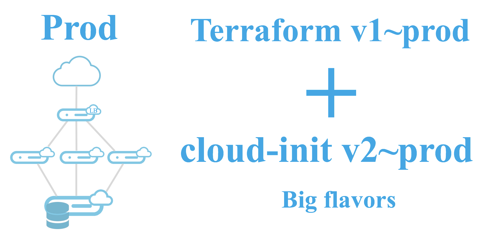

This folder represents a production environment. The goal is to automatize it to reproduce the tested environment.

# Target Infrastructure

This is the same infrastructure than in test environment but here we don't need the stress part.



# Exercise

This exercise will be very short. We'll just switch the app module source from local folder to a versioned repository. The goal is to illustrate how to work with an "Infrastructure as Code". Here you, or one your team member, tested and identified a version of your module as stable and production ready. This version has been pushed into a git repository. To use it in production, you just have to target it with the right version in the source module.

## main.tf

Like previously, this is the orchestration for the prod environment.

This file contains in the order:

  * An OpenStack provider which takes its configuration from environment variables
  * A keypair resource
  * A module "app"
    * Here we have to switch from local folder to the identified version on the git repository
    * **Change the source line:**
      ```
        source = "git::https://github.com:pilgrimstack/workshop-301.git//terraform-modules/app?ref=v2.0"
      ```
  * Some variables

> If in doubt, you can have a look at the file main.tf
>
> If you are really lost, just copy the main.tf to main.tf
> ```bash
> cp main.tf main.tf
> ```

## Launch the production environment

We need to import the modules. It will be copied into the local .terraform folder as an active copy.
```bash
terraform get
```

To intialize the Terraform environment and especially the providers, run this command:
```bash
terraform init
```

Now we'll see in advance what Terraform plans to do.
```bash
terraform plan
```

Then run it!
```bash
terraform apply
```

Here we told Terraform to deploy only the keypair and the stress module (bypassing the app module in fact).

Of course you can check it with:
```bash
openstack server list
```

## Scale Up!

Something really interesting with Terraform is that it is a stateful orchestration tool. Imagine your Wordpress has a huge succes and you need to more power on your frontweb servers.

Open the main.tf file, in the module app, increase the count number with count = 3 and again, plan and apply with Terraform.

```bash
terraform plan -target module.app
terraform apply -target module.app
```

As you can see, Terraform knows there already are 2 frontweb servers, it'll simply start the 3rd one.

If you have time, you can run the rollback to scale down your infra.

## Clean

It's time to delete your resources once again.

```bash
terraform destroy
```

# Well done!

You learned how to:
  * Use the CLI and start scripting
  * Use cloud-init
  * Create resources with Terraform
  * Use different Terraform provisioners
  * Use Terraform templating
  * Inject intelligence in orchestration with dependencies
  * Target a specific version of your code in your deployment

You are "Infrastructure as Code" approved!
